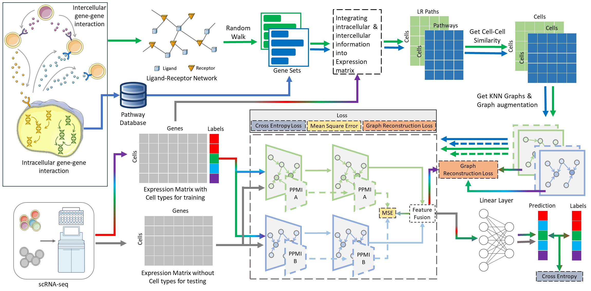

# scPriorGraph：Constructing Biosemantic Cell-Cell Graphs with Prior Gene Set Selection for Cell Type Identification from scRNA-seq Data


We created a method scPriorGraph based on Python and R that uses `torch` to identify cell types in scRNA-seq data. This project is a simple implementation of scPriorGraph.

## 1. Requirements
### 1.1 Python requirements
+ Python == 3.9
+ torch == 2.2.0
+ rpy2 == 3.5.15
+ scanpy == 1.9.8
+ snfpy == 0.2.2

The other packages used in our project are included in the `requirements.txt` file. You can refer to this file to configure the experimental environment.
### 1.2 R requirements
+ R == 4.2.2
+ GSEABase == 1.60.0
+ AUCell == 1.20.2
+ SingleCellExperiment == 1.20.1

## 2. Installation Tutorial

### 2.1 Create Environment

```
conda create -n scPriorGraph python=3.9
conda activate scPriorGraph
conda install conda install pytorch==2.2.0 torchvision==0.17.0 torchaudio==2.2.0 pytorch-cuda=11.8 -c pytorch -c nvidia
```

### 2.2 Install Dependent Packages
```
pip install -r ./requirements.txt
```
Please ensure that this command is run in the conda environment required by the project.

### 2.3 Setup R Environment
#### Step 1: Ensure that you have installed rpy2 in your environment.
You can run the following code to check if `rpy2` is successfully installed:
```
pip show rpy2
```
#### Step 2: Configure the Path and Environment Variables

Before proceeding with the following steps, please ensure that your computer is running the Windows operating system and that R for Windows is installed.

+ Press the Windows+X to access the Power User Task Menu and then select the System option.
+ In the System > About window, click the Advanced system settings link below the Device specifications section.
+ In the System Properties window, click the Advanced tab and then click the Environment Variables button.
+ Create a separate environment variable, set the variable name to R_HOME, and set the variable value to D:\Program Files\R\R-4.2.2. You should replace the path with the installation path of R on your computer. If you have not yet installed the R, please visit https://cran.r-project.org/bin/windows/base/old/ to download and install the appropriate version of R for Windows.
+ Next, you can check if the installation was successful and if it's usable by importing the rpy2 package.
```
import rpy2.robjects as robjects
```
#### Step 3: Install R packages related to the project.

```
if (!requireNamespace("BiocManager", quietly = TRUE))
    install.packages("BiocManager")

BiocManager::install("GSEABase", version = "1.60.0")
BiocManager::install("AUCell", version = "1.20.2")
BiocManager::install("SingleCellExperiment", version = "1.20.1")
```


### 2.4 Other Information
We recommend using PyCharm to run this method. 
This project needs to invoke R to run the code. 
Please make sure that you have already installed the R environment (version 4.2.2) and have installed the required R packages before running this project.   
The work to release the project as an installable package is currently in progress.


## Usage
### Step 1: Prepare data
The standard data format that the model can accept is a gene expression matrix where rows represent cells and columns represent genes. The cell label file should have cell indices that match those in the expression matrix. The reference dataset and the query dataset should have the same gene names and the same number of genes, and gene names should be in lowercase.

### Step 2: Training the model and Prediction

```
python ./scPriorGraph.py --ref bh --query se --pathway KEGGHuman
```

#### Input
+ `ref`: The name of the dataset used for training the model.
+ `query`: The name of the dataset used for prediction.
+ `pathway`: The pathway selected by the user.

#### Output
+ `pred.csv`: The predicted results for cell types in the query dataset.

## Datasets
You can download the sample dataset from Google Drive at the following link: https://drive.google.com/drive/folders/1sFbU3Wd9Ai1vlNeJH6_QkxLwWBI0WKSS?usp=sharing

After downloading the files, copy `L_bh.csv` and `M_bh.csv` into the `./data/ref` folder in the root directory, and copy `L_se.csv` and `M_se.csv` into the `./data/query` folder in the root directory.